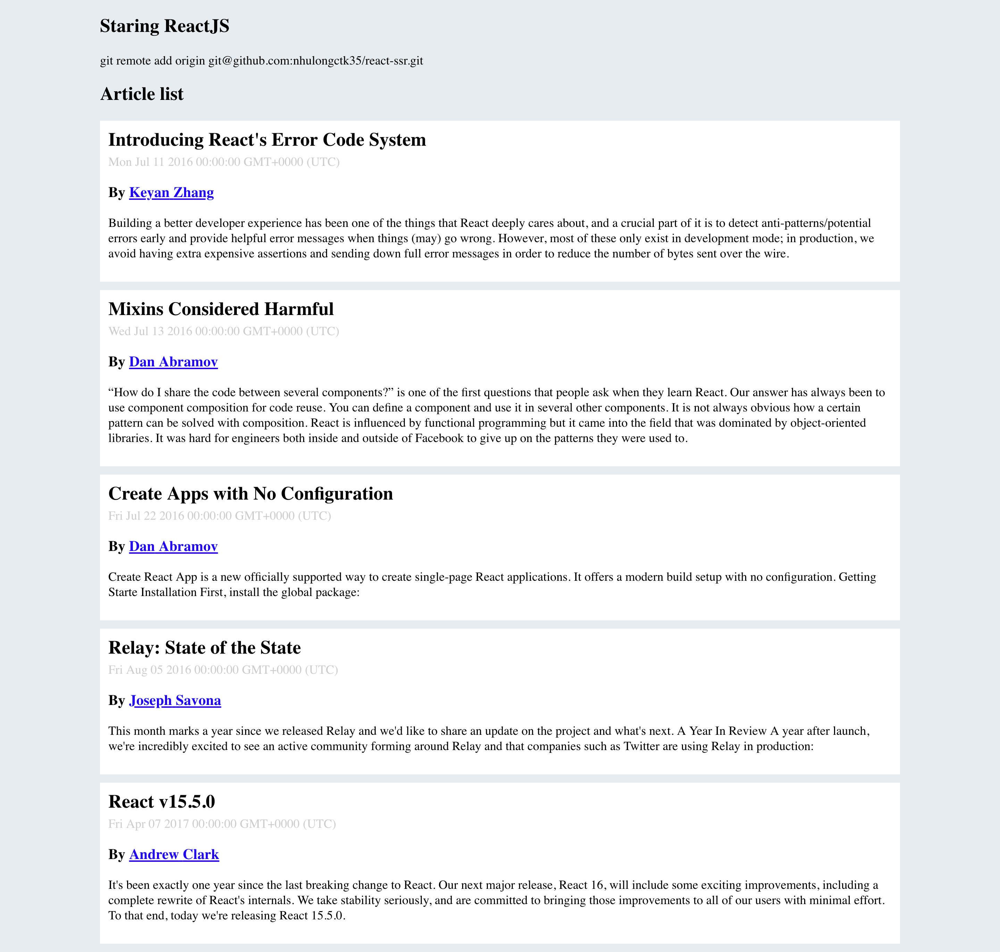

## Demo React SSR (Server Side Rendering)



### Install dependencies
``npm install or yarn install``

### Development
> starting webpack

```yarn webpack```

> starting node server

``yarn start``

> go to http://localhost:3000/ and watch the result.